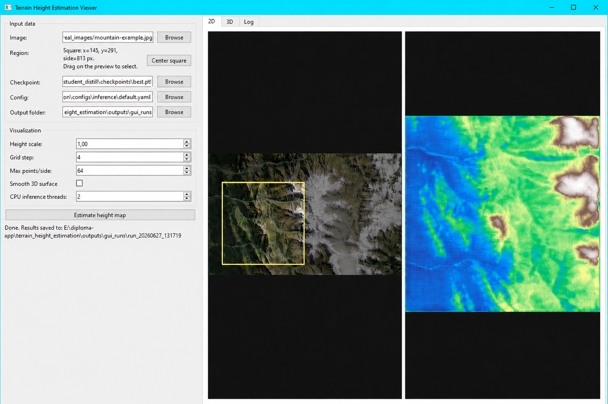

# Terrain Height Estimation


Desktop and CLI prototype for estimating a terrain height map from remote-sensing-style imagery.

The project combines a PyTorch dense regression model, a synthetic terrain data generator, training and inference pipelines, and a Qt desktop viewer for interactive demonstrations.



## Why This Project Exists

Estimating elevation from a single image is an ambiguous computer vision problem: lighting, shadows, color, snow, and terrain material can look similar while representing different geometry. This repository explores that problem in a controlled setting by generating synthetic terrain, training U-Net-based regressors, and visualizing predicted height maps in 2D and 3D.

The current implementation is a research and portfolio prototype, not a production DEM reconstruction system.

## Demo Application

The GUI is implemented in `apps/terrain_viewer_qt.py` using PySide6 and pyqtgraph/OpenGL.

It provides:

1. Image, checkpoint, config, and output-folder selection.
2. Interactive square crop selection on the input preview.
3. Inference launched in a separate process so the UI remains responsive.
4. Side-by-side 2D preview of the selected image and predicted height map.
5. OpenGL 3D surface visualization with height scale, grid stride, point-density, and smoothing controls.
6. Run log and saved outputs for each GUI inference session.

<!-- Portfolio screenshot suggestion: save the GUI screenshot as docs/assets/terrain-viewer.png and add it near this section. -->

## What This Demonstrates

1. End-to-end ML application design: data generation, model training, inference, and UI integration.
2. PyTorch model implementation for dense image-to-image regression.
3. Config-driven experiments with YAML and command-line overrides.
4. Synthetic data generation with terrain height maps, lighting, shadows, metadata, and train/validation manifests.
5. Desktop application development with Qt, OpenGL visualization, file dialogs, logs, and subprocess management.
6. Practical handling of monocular ambiguity through paired-image modes, shadow masks, metadata conditioning, augmentation, and explicit validation metrics.

## Tech Stack

1. Python
2. PyTorch
3. NumPy, OpenCV, Pillow
4. Matplotlib
5. PyYAML
6. PySide6
7. pyqtgraph and PyOpenGL

## Repository Layout

```text
terrain_height_estimation/
  apps/
    terrain_viewer_qt.py          # Qt desktop viewer
  configs/
    generation/                   # dataset generation configs
    inference/                    # inference configs
    training/                     # training configs
  data/
    generated/                    # generated datasets, if present locally
    real_images/                  # local demo images, if present locally
  scripts/
    generate_dataset.py           # synthetic dataset generation entry point
    infer.py                      # CLI inference entry point
    train.py                      # training entry point
  src/
    dataset/                      # dataset loading and input-mode assembly
    generation/                   # procedural terrain/rendering logic
    inference/                    # checkpoint loading and prediction logic
    models/                       # U-Net model definition
    training/                     # training loop, losses, distillation support
    utils/                        # config, IO, metrics, metadata, visualization
  stage1-best/                    # local saved checkpoints, if present
  stage3-best/                    # local saved checkpoints, if present
  stage4-best/                    # local saved checkpoints, if present
```

Large generated datasets, outputs, and checkpoints are usually not suitable for committing to Git. The repository `.gitignore` excludes `outputs/` and common checkpoint extensions.

## Installation

Create and activate a virtual environment, then install the required packages.

```bash
python -m venv .venv
source .venv/bin/activate
pip install -r requirements.txt
```

For the desktop viewer, install GUI dependencies as well:

```bash
pip install -r requirements-gui.txt
```

On Windows PowerShell, activate the environment with:

```powershell
.venv\Scripts\Activate.ps1
```

## Run The GUI

```bash
python apps/terrain_viewer_qt.py
```

The default GUI workflow is intended for single-image inference checkpoints. Pair, metadata, and shadow-mask models can be used from the CLI by passing the required auxiliary inputs.

## Generate A Synthetic Dataset

```bash
python scripts/generate_dataset.py --config configs/generation/mvp.yaml
```

This writes a dataset under `data/generated/mvp_dataset/` by default. Each generated sample can include:

1. `rgb.png`
2. `rgb_alt.png`
3. `height.npy`
4. `height_vis.png`
5. `normal.npy`
6. `shadow_mask.png`
7. `meta.json`

The generator also writes dataset manifests such as `manifest.csv`, `train.csv`, and `val.csv`.

For a smaller smoke-test dataset, override the sample count:

```bash
python scripts/generate_dataset.py --config configs/generation/mvp.yaml dataset.num_samples=16
```

## Train A Model

```bash
python scripts/train.py --config configs/training/mvp.yaml
```

Training outputs are written to `training.output_dir`, which is `outputs/mvp_baseline/` in the default MVP config. The training pipeline saves:

1. `checkpoints/best.pt`
2. `checkpoints/last.pt`
3. `samples/epoch_xxx/` preview images
4. `history.json`

Resume training from a saved checkpoint:

```bash
python scripts/train.py --config configs/training/mvp.yaml --resume outputs/mvp_baseline/checkpoints/last.pt
```

## Run CLI Inference

The default MVP training config uses `rgb_pair_full_metadata`, so inference needs the primary image, alternate image, and metadata file:

```bash
python scripts/infer.py --config configs/inference/default.yaml --checkpoint outputs/mvp_baseline/checkpoints/best.pt --image data/generated/mvp_dataset/samples/sample_00000/rgb.png --image-alt data/generated/mvp_dataset/samples/sample_00000/rgb_alt.png --metadata data/generated/mvp_dataset/samples/sample_00000/meta.json
```

Inference writes the configured output directory, defaulting to `outputs/inference/`, with:

1. `pred_height.npy`
2. `pred_height.png`
3. `prediction_overview.png`

For checkpoints that also require shadow masks, pass the mask files explicitly:

```bash
python scripts/infer.py --config configs/inference/default.yaml --checkpoint stage4-best/best.pt --image data/generated/simple_geometry_d3_nr/samples/sample_00000/rgb.png --image-alt data/generated/simple_geometry_d3_nr/samples/sample_00000/rgb_alt.png --metadata data/generated/simple_geometry_d3_nr/samples/sample_00000/meta.json --shadow-mask data/generated/simple_geometry_d3_nr/samples/sample_00000/shadow_mask.png --shadow-mask-alt data/generated/simple_geometry_d3_nr/samples/sample_00000/shadow_mask_alt.png
```

The exact required arguments depend on the `input_mode` saved in the checkpoint configuration.

## Supported Input Modes

The dataset and inference code support several input representations:

1. `rgb`: one RGB image.
2. `grayscale`: one grayscale image.
3. `rgb_pair`: two RGB images concatenated channel-wise.
4. `grayscale_pair`: two grayscale images.
5. `grayscale_shadow_sun`: grayscale image, shadow mask, and sun metadata.
6. `grayscale_pair_shadow_sun`: image pair, primary shadow mask, and sun metadata.
7. `grayscale_pair_shadowmask_sun`: image pair, two shadow masks, and sun metadata.
8. `rgb_pair_shadowmask_sun`: RGB image pair, two shadow masks, and sun metadata.
9. `rgb_pair_metadata`: RGB pair and compact sun metadata.
10. `rgb_pair_full_metadata`: RGB pair and configured capture metadata.

## Model And Training Details

The model in `src/models/unet.py` is a U-Net-style encoder-decoder network with skip connections and a single-channel sigmoid output for normalized height prediction.

Training uses:

1. `AdamW` optimizer.
2. Combined loss with L1, gradient, and SSIM components.
3. Validation metrics including MAE, RMSE, gradient error, shadow MAE, non-shadow MAE, and boundary MAE.
4. Optional checkpoint resume and compatible-weight loading.
5. Optional teacher-student distillation support in the training engine.

## Synthetic Data Strategy

The procedural generator creates normalized height maps and renders terrain-like RGB images using surface normals, lighting, shadows, albedo variation, camera metadata, and optional alternate illumination.

The generation configs include controls for:

1. Terrain smoothness, ridges, peaks, valleys, and elevation scale.
2. Sun azimuth/elevation and alternate illumination.
3. Shadow strength and rendering parameters.
4. Albedo randomization to reduce simple color-to-height shortcuts.
5. Curriculum-style shadow geometry datasets.

## Known Limitations

1. Monocular height estimation remains fundamentally ambiguous, especially in shadowed or textureless areas.
2. The model is trained primarily on synthetic data, so real-image predictions should be treated as qualitative demonstrations unless validated against real elevation data.
3. The GUI default flow passes a single selected crop to inference; models that require image pairs, metadata, or shadow masks need the CLI path or additional UI wiring.
4. Large datasets and checkpoints are local artifacts and may need to be regenerated or downloaded separately when cloning the repository.

## Roadmap

1. Add a committed GUI screenshot and short demo GIF/video for the portfolio page.
2. Provide a small downloadable checkpoint compatible with the default single-image GUI workflow.
3. Add automated tests for config loading, dataset records, and inference smoke tests.
4. Add real DEM-based validation when paired image/elevation data is available.
5. Improve packaging for non-technical users, for example with a desktop launcher or installer.
